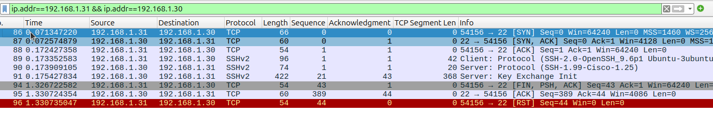

## TTLinks Network Toolkit Overview

**TTLinks** is a comprehensive toolkit designed for network engineers and administrators. It provides utilities for managing and analyzing IP addresses, MAC addresses, and related network components. The package supports IP and MAC address classification, OUI lookups, and binary data manipulation, streamlining tasks essential to network management.

## Note
<font color='red'>This library uses raw sockets, which are restricted on Windows OS. Therefore, it is designed specifically for use on Linux-based systems.</font>

## Installation
This project is available on PyPI and can be installed using pip:
```bash
pip install ttlinks
```

### Common Utilities
**TTLinks** includes a set of common utilities that provide essential functionality for network management tasks. These utilities are designed to be reusable and extensible, offering a foundation for building more complex network tools.
For more details, visit:
- [Common Utilities](docs/common/common_utilities.md)

### IP Services
The IP service module in **TTLinks** offers a variety of tools to classify and work with both IPv4 and IPv6 addresses. These services allow you to:
- Identify address types (public, private, multicast, etc.)
- Perform address calculations, subnetting operations, and wildcard calculation.

For more details, visit:
- [IP Address Services](docs/ipservice/ip_services.md)
- [design diagram](docs/ipservice/Class%20Diagram.pdf)

### MAC Services
**TTLinks** includes a powerful MAC service module for validating MAC addresses, converting between various formats, and performing OUI lookups using a local database. This is especially useful for managing devices across a network.

For more details, visit:
- [MAC Address Services](docs/macservice/mac_services.md)
- [design diagram](docs/macservice/Class%20Diagram.pdf)

### Ping Check Services
- **Reachability (Ping) Checks**: Test the reachability of hosts over the network using ICMP ping.
```python
from ttlinks.protocol_stack.network_layer.ICMP.icmp_manager import ICMPPingManager
from ttlinks.ipservice.ip_configs import IPv4SubnetConfig

manager = ICMPPingManager()
# ping single target
responses1 = manager.ping('8.8.8.8', timeout=2, interval=1, count=2, verbose=True)
print(responses1)
# ping multiple targets
ips = IPv4SubnetConfig('8.8.8.8/31').get_hosts()
responses2 = manager.ping_multiple(ips, timeout=2, interval=1, count=2, verbose=True)
print(responses2)
```
For more details, visit:
- [ICMP] (docs/protocol_stack/network_layer/ICMP.md)

### Protocol Stack
The protocol stack module in **TTLinks** provides a framework for working with network protocol data units (PDUs) at different layers of the TCP/IP model. This module allows you to create, parse, and manipulate protocol headers, making it easier to analyze network traffic and build custom network tools. The protocol stack currently supports Ethernet, IPv4, and ICMP headers. Example applications include packet crafting, network monitoring, port scanning, and more.

For more details, visit:
- [Protocol Stack](docs/protocol_stack/protocol_stack.md)

#### Example1: Creating IPv4 TCP Packet
```python
from ttlinks.protocol_stack.ip_packets.tcp import IPv4TCP
from ttlinks.protocol_stack.network_layer.IPv4.flags_utils import IPv4Flags
from ttlinks.protocol_stack.transport_layer.TCP.tcp_utils import TCPFlags

tcp = IPv4TCP(
    ipv4_flags=IPv4Flags.DONT_FRAGMENT,
    ttl=32,
    destination_address='192.168.1.30',
    source_port=54156,
    destination_port=22,
    sequence_number=1370412840,
    tcp_flags=[TCPFlags.SYN],
)
# check packet in bytes
print(tcp.packet)  
# check ip header
print(tcp.ip_unit.as_bytes)
print(tcp.ip_unit.summary)
# check tcp header  
print(tcp.tcp_unit.as_bytes)
print(tcp.tcp_unit.summary)
```

#### Example2: Creating IPv4 TCP Flow and Completing 3-way Handshake (Asynchronous)
```python
import asyncio
from ttlinks.protocol_stack.traffic_flows.TCP.tcp_flow import IPv4TCPFlowController
from ttlinks.protocol_stack.ip_packets.tcp import IPv4TCP
from ttlinks.protocol_stack.network_layer.IPv4.flags_utils import IPv4Flags
from ttlinks.protocol_stack.transport_layer.TCP.tcp_utils import TCPFlags
init_tcp_packet = IPv4TCP(
    ipv4_flags=IPv4Flags.DONT_FRAGMENT,
    ttl=32,
    destination_address='192.168.1.30',
    source_port=54156,
    destination_port=22,
    sequence_number=1370412840,
    tcp_flags=[TCPFlags.SYN],
)

tcp_flow = IPv4TCPFlowController(init_tcp_packet, timeout=1)

asyncio.run(tcp_flow.handshake())
asyncio.run(tcp_flow.application_data('SSH-2.0-OpenSSH_9.6p1 Ubuntu-3ubuntu13.7\r\n'.encode()))
asyncio.run(tcp_flow.close())
print(tcp_flow.is_handshake_completed)
```



### Port Scan Services
- **Port Scanning**: Scan a range of TCP ports on target hosts to identify open services.
```python
import asyncio
from ttlinks.ipservice.ip_address import IPAddr, IPv4Addr
from ttlinks.port_scanning.tcp_scanner import IPv4TCPScanner
ipv4_destinations = [
    IPv4Addr('192.168.1.20'),
    IPv4Addr('192.168.1.30')
]
scanner = IPv4TCPScanner(
    ipv4_destinations,
    ports=[1, 1024],
    timeout=10,
)
asyncio.run(scanner.complete_scan())
```
Example output:
```
Scan Report: {
'192.168.1.20': {22: True, 25: True, 53: True, 80: True, 139: True, 443: True, 445: True, 554: True, 515: True, 631: True, 587: True, 993: True}, 
'192.168.1.30': {80: True, 22: True, 443: True}
}
```

### Test Cases
If you're interested in seeing how these modules function in practice, check out the test cases. They provide a great way to understand how the different components work together.

For more details, visit:
- [IP Address Services Test Cases](ttlinks/tests/)


### Future Updates
**TTLinks** will be continuously evolving, with planned updates to include additional features aimed at expanding its utility for network monitoring, diagnostics and automation. Upcoming features will include:
- **Port Checks**: Check the availability of specific ports on a given host to verify service access.
- **DNS Lookup**: Query DNS records (A, AAAA, CNAME, MX, etc.) for a domain to assist with DNS-related issues.
- **WHOIS Check**: Retrieve domain registration and ownership information.
- **AS Number Lookup**: Look up Autonomous System (AS) numbers for specific IPs to analyze routing information.
- **Public IP Geolocation**: Tools for determining the geographic location of public IPs.
- **SSL/TLS Certificate Checker**: A service to validate SSL/TLS certificates, including expiration checks and cipher strength evaluation.

These future features will further enhance **TTLinks** as a versatile toolkit for network management and diagnostics.


## Contributing
Contributions to this project are welcome! Please feel free to submit issues or pull requests on <a href='https://github.com/tyt063144/TTLinks'>GitHub</a>.

## License
**TTLinks** is licensed under the MIT License. You are free to use, modify, and distribute the software with appropriate attribution.

## Contact
For further information, please contact Yantao Tao at tytccie@gmail.com.