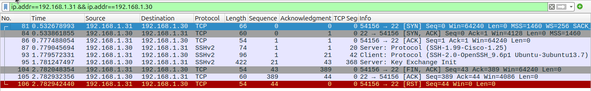

## TTLinks Overview  
**TTLinks** is a powerful and practical toolkit based on `Python` and designed for network engineers and administrators who value efficiency and simplicity. By consolidating essential tools into one platform, TTLinks reduces complexity and enhances productivity, enabling users to tackle network challenges with ease. Whether you’re managing configurations, troubleshooting, or optimizing performance, TTLinks provides a seamless experience, making it an essential resource for modern network management.
It includes the following major modules:
- `ipservice`: [IP Address Service](docs/ipservice/ip_service.md)

## Note
<font color="red">This library utilizes raw sockets, which are restricted on Windows OS. As a result, it is specifically designed for use on Linux-based systems.</font>

## Installation
This project is available on PyPI and can be installed using pip:
```bash
pip install ttlinks
```

---

## Application Examples
### 1. `ipservice` - IP Address Services
The IP service module in **TTLinks** offers a variety of tools to classify and work with both IPv4 and IPv6 host addresses.

<details>

**TTLinks** provides a way to create host interface IP object for IPv4. The following example demonstrates how to create an IPv4 host object and access its properties:

<summary>Example1: IPv4 Host</summary>

```python
from ttlinks.ipservice.ip_factory import IPv4Factory
ipv4_factory = IPv4Factory()
ipv4_host = ipv4_factory.host('192.168.1.10/24')

print('Display Address Information'.center(50, '-'))
address = ipv4_host.addr  # IPv4Addr object
address_in_bytes = address.as_bytes  # ipv4 address in bytes format, big-endian
address_in_binary_string = address.binary_string  # ipv4 address in binary string format
address_in_binary_digits = address.binary_digits  # ipv4 address in binary digits format
address_in_decimal = address.decimal  # ipv4 address in decimal format
print('%-8s'%'address:', address)
print('%-8s'%'bytes:', address_in_bytes)
print('%-8s'%'binary:', address_in_binary_string)
print('%-8s'%'digits:', address_in_binary_digits)
print('%-8s'%'decimal:', address_in_decimal)

print('Display Mask Information'.center(50, '-'))
mask = ipv4_host.mask  # IPv4Netmask object
mask_in_bytes = mask.as_bytes  # mask in bytes format, big-endian
mask_in_binary_string = mask.binary_string  # mask in binary string format
mask_in_binary_digits = mask.binary_digits  # mask in binary digits format
mask_in_decimal = mask.decimal  # mask in decimal format
print('%-8s'%'mask:', mask)
print('%-8s'%'bytes:', mask_in_bytes)
print('%-8s'%'binary:', mask_in_binary_string)
print('%-8s'%'digits:', mask_in_binary_digits)
print('%-8s'%'decimal:', mask_in_decimal)

print('Display Host Information'.center(50, '-'))
ip_address = ipv4_host.addr.address  # Dot-decimal notation of IPv4Addr object
ip_mask = ipv4_host.mask.address  # Dot-decimal notation of IPv4Netmask object
ip_type = ipv4_host.ip_type  # Return IPv4AddrType object
network_id = ipv4_host.network_id  # IPv4Addr object of network ID. Use .address to get the string format
broadcast_ip = ipv4_host.broadcast_ip  # IPv4Addr object of broadcast IP. Use .address to get the string format
is_public = ipv4_host.is_public  # Return True if the IP address is public
is_private = ipv4_host.is_private  # Return True if the IP address is private
# ...more attributes and methods
print('%-10s'%'host:', ipv4_host)  # IPv4Host object. Use str() to get the string format
print('%-10s'%'address:', ip_address)
print('%-10s'%'mask:', ip_mask)
print('%-10s'%'type:', ip_type)
print('%-10s'%'NET ID:', network_id)
print('%-10s'%'broadcast:', broadcast_ip)
print('%-10s'%'public?:', is_public)
print('%-10s'%'private?:', is_private)
```
Example output:
```
-----------Display Address Information------------
address: 192.168.1.10
bytes:   b'\xc0\xa8\x01\n'
binary:  11000000101010000000000100001010
digits:  [1, 1, 0, 0, 0, 0, 0, 0, 1, 0, 1, 0, 1, 0, 0, 0, 0, 0, 0, 0, 0, 0, 0, 1, 0, 0, 0, 0, 1, 0, 1, 0]
decimal: 3232235786
-------------Display Mask Information-------------
mask:    255.255.255.0
bytes:   b'\xff\xff\xff\x00'
binary:  11111111111111111111111100000000
digits:  [1, 1, 1, 1, 1, 1, 1, 1, 1, 1, 1, 1, 1, 1, 1, 1, 1, 1, 1, 1, 1, 1, 1, 1, 0, 0, 0, 0, 0, 0, 0, 0]
decimal: 4294967040
-------------Display Host Information-------------
host:      192.168.1.0/24
address:   192.168.1.10
mask:      255.255.255.0
type:      IPv4AddrType.PRIVATE
NET ID:    192.168.1.0
broadcast: 192.168.1.255
public?:   False
private?:  True
```
</details>

<details>
<summary>Example2: IPv4 Subnet</summary>

Under `.subnet` method, **TTLinks** simplifies address configuration by automatically adjusting an address to match its corresponding network ID, treating it as a subnet rather than a host. Users don’t need to manually calculate the network ID or broadcast IP when creating a subnet object. The following example illustrates how to create an IPv4 subnet object and access its properties: `192.170.50.10/14` -> `192.168.1.0/24`. It also inherits all the properties and methods from the IPv4Host class.

```python
from ttlinks.ipservice.ip_factory import IPv4Factory
ipv4_factory = IPv4Factory()
ipv4_subnet = ipv4_factory.subnet('192.170.50.10/14')

print('Display Address Information'.center(50, '-'))
address = ipv4_subnet.addr  # IPv4Addr object. TTLinks helps to adjust the address to the network ID of given value automatically because it is a subnet instead of a host.
address_in_bytes = address.as_bytes  # ipv4 address in bytes format, big-endian
address_in_binary_string = address.binary_string  # ipv4 address in binary string format
address_in_binary_digits = address.binary_digits  # ipv4 address in binary digits format
address_in_decimal = address.decimal  # ipv4 address in decimal format
print('%-8s'%'address:', address)
print('%-8s'%'bytes:', address_in_bytes)
print('%-8s'%'binary:', address_in_binary_string)
print('%-8s'%'digits:', address_in_binary_digits)
print('%-8s'%'decimal:', address_in_decimal)

print('Display Mask Information'.center(50, '-'))
mask = ipv4_subnet.mask  # IPv4Netmask object
mask_in_bytes = mask.as_bytes  # mask in bytes format, big-endian
mask_in_binary_string = mask.binary_string  # mask in binary string format
mask_in_binary_digits = mask.binary_digits  # mask in binary digits format
mask_in_decimal = mask.decimal  # mask in decimal format
print('%-8s'%'mask:', mask)
print('%-8s'%'bytes:', mask_in_bytes)
print('%-8s'%'binary:', mask_in_binary_string)
print('%-8s'%'digits:', mask_in_binary_digits)
print('%-8s'%'decimal:', mask_in_decimal)

print('Display Subnet Information'.center(50, '-'))
ip_address = ipv4_subnet.addr.address  # Dot-decimal notation of IPv4Addr object
ip_mask = ipv4_subnet.mask.address  # Dot-decimal notation of IPv4Netmask object
ip_type = ipv4_subnet.ip_type  # Return all possible IPv4AddrType objects the subnet may lie in
network_id = ipv4_subnet.network_id  # IPv4Addr object of network ID. Use .address to get the string format
broadcast_ip = ipv4_subnet.broadcast_ip  # IPv4Addr object of broadcast IP. Use .address to get the string format
subnet_range = ipv4_subnet.subnet_range  # Return the range of the subnet. Left is the network ID, right is the broadcast IP
first_host = ipv4_subnet.first_host  # IPv4Addr object of the first host IP. Use .address to get the string format
last_host = ipv4_subnet.last_host  # IPv4Addr object of the last host IP. Use .address to get the string format
hosts = ipv4_subnet.get_hosts()  # Return a generator of all host IPs in the subnet
is_within1 = ipv4_subnet.is_within('192.168.169.50')  # Check if the given IP address is within the subnet
is_within2 = ipv4_subnet.is_within('192.172.1.1')  # Check if the given IP address is within the subnet
print('%-10s'%'subnet:', ipv4_subnet)
print('%-10s'%'address:', ip_address)
print('%-10s'%'mask:', ip_mask)
print('%-10s'%'type:', ip_type)
print('%-10s'%'NET ID:', network_id)
print('%-10s'%'broadcast:', broadcast_ip)
print('%-10s'%'range:', subnet_range)
print('%-10s'%'first:', first_host)
print('%-10s'%'last:', last_host)
print('%-10s'%'hosts:', [next(hosts) for _ in range(5)])
print('%-10s'%'is within1:', is_within1)
print('%-10s'%'is within2:', is_within2)

print('Display Subnet Operation'.center(50, '-'))  # Exclusive for subnet object
new_subnet = ipv4_subnet.division(16)  # Divide the subnet into /16 subnets.
merged_subnet = ipv4_subnet.merge('192.172.0.0/14')  # Merge the subnet with another subnet.
print('%-14s'%'new subnet:', list(new_subnet))
print('%-14s'%'merged subnet:', merged_subnet)
```
Example output:
```
-----------Display Address Information------------
address: 192.168.0.0
bytes:   b'\xc0\xa8\x00\x00'
binary:  11000000101010000000000000000000
digits:  [1, 1, 0, 0, 0, 0, 0, 0, 1, 0, 1, 0, 1, 0, 0, 0, 0, 0, 0, 0, 0, 0, 0, 0, 0, 0, 0, 0, 0, 0, 0, 0]
decimal: 3232235520
-------------Display Mask Information-------------
mask:    255.252.0.0
bytes:   b'\xff\xfc\x00\x00'
binary:  11111111111111000000000000000000
digits:  [1, 1, 1, 1, 1, 1, 1, 1, 1, 1, 1, 1, 1, 1, 0, 0, 0, 0, 0, 0, 0, 0, 0, 0, 0, 0, 0, 0, 0, 0, 0, 0]
decimal: 4294705152
------------Display Subnet Information------------
subnet:    192.168.0.0/14
address:   192.168.0.0
mask:      255.252.0.0
type:      [<IPv4AddrType.PRIVATE: 4>, <IPv4AddrType.PUBLIC: 3>]
NET ID:    192.168.0.0
broadcast: 192.171.255.255
range:     [IPv4Addr('_address=192.168.0.0'), IPv4Addr('_address=192.171.255.255')]
first:     192.168.0.1
last:      192.171.255.254
hosts:     [
                IPv4Addr('_address=192.168.0.1'), 
                IPv4Addr('_address=192.168.0.2'), 
                IPv4Addr('_address=192.168.0.3'), 
                IPv4Addr('_address=192.168.0.4'), 
                IPv4Addr('_address=192.168.0.5')
            ]
is within1: True
is within2: False
-------------Display Subnet Operation-------------
new subnet:    [IPv4SubnetConfig(192.168.0.0/16), IPv4SubnetConfig(192.169.0.0/16), IPv4SubnetConfig(192.170.0.0/16), IPv4SubnetConfig(192.171.0.0/16)]
merged subnet: 192.168.0.0/13
```
</details>

<details>

<summary>Example3: IPv4 WildCard</summary>

WildCard is a special type of subnet mask that is typically used in access control lists (ACLs) to define a range of IP addresses. **TTLinks** provides a way to calculate the address automatically based on the wildcard mask provided. The following example demonstrates how to create an IPv4 wildcard object and access its properties:

```python
from ttlinks.ipservice.ip_address import IPv4Addr
from ttlinks.ipservice.ip_factory import IPv4Factory

ipv4_factory = IPv4Factory()
wildcard = ipv4_factory.wildcard('10.100.65.5 0.255.1.7')

print('Display WildCard Information'.center(50, '-'))
address = wildcard.addr  # IPv4Addr object.
mask = wildcard.mask  # IPv4Wildcard object.
total_hosts = wildcard.total_hosts  # Total number of hosts covered by the wildcard mask.
hosts = [host for host in wildcard.get_hosts()]  # List of hosts covered by the wildcard mask. `.get_hosts()` returns a generator, so be careful when using it.


# WildCard address is automatically adjusted based on the wildcard mask provided. The bit in the address will be set to 0 if the corresponding bit in the wildcard mask is 1.
print('%-10s'%'wildcard:', wildcard)  
print('original:', IPv4Addr('10.100.65.5').binary_string)  # Original address in binary string format
print('%-10s'%'address:', address.binary_string)  # Adjusted address in binary string format
print('%-10s'%'mask:', mask.binary_string)  # Wildcard mask in binary string format
print('%-10s'%'total hosts:', total_hosts)  # Total number of hosts covered by the wildcard mask
print('%-10s'%'hosts:', hosts[:5], '...', hosts[-5:])  # List of hosts covered by the wildcard mask
```
Example output:
```
-----------Display WildCard Information-----------
wildcard:  10.0.64.0 0.255.1.7
original:  00001010011001000100000100000101
address:   00001010000000000100000000000000
mask:      00000000111111110000000100000111
total hosts: 4096
hosts:     [
                IPv4Addr('_address=10.0.64.0'), 
                IPv4Addr('_address=10.0.64.1'), 
                IPv4Addr('_address=10.0.64.2'), 
                IPv4Addr('_address=10.0.64.3'), 
                IPv4Addr('_address=10.0.64.4')
            ] 
            ... 
            [
                IPv4Addr('_address=10.255.65.3'), 
                IPv4Addr('_address=10.255.65.4'), 
                IPv4Addr('_address=10.255.65.5'), 
                IPv4Addr('_address=10.255.65.6'), 
                IPv4Addr('_address=10.255.65.7')
            ]
```
</details>


<details>

<summary>Example4: Minimum IPv4 WildCard Calculation</summary>

**TTLinks** provides a tool to calculate the minimum wildcard mask for a list of subnets. This is useful for identifying the smallest possible wildcard mask that can cover all the subnets in the list. The following example demonstrates how to calculate the minimum wildcard mask for a list of IPv4 subnets:

```python
from ttlinks.ipservice.wildcard_calculator import calculate_minimum_ipv4_wildcard

# Create a list of IPv4 subnets
subnets = [
    '10.10.25.0/24',
    '10.50.25.0/24',
    '10.90.25.0/24',
    '10.130.25.0/24',
    '10.170.25.0/24',
    '10.220.25.0/24',
    '10.255.25.0/24',
]

# Calculate the minimum wildcard mask for the list of subnets
wildcard = calculate_minimum_ipv4_wildcard(*subnets)

print('Display WildCard Information'.center(50, '-'))
address = wildcard.addr.address  # Dot-decimal notation of IPv4Addr object.
mask = wildcard.mask.address  # Dot-decimal notation of IPv4Wildcard object.
total_hosts = wildcard.total_hosts  # Total number of hosts covered by the wildcard mask.
hosts = [host for host in wildcard.get_hosts()]  # List of hosts covered by the wildcard mask. `.get_hosts()` returns a generator, so be careful when using it.
print('%-10s'%'wildcard:', wildcard)  # IPv4WildCardConfig object. Use str() to get the string format.
print('%-10s'%'address:', address) 
print('%-10s'%'mask:', mask)  
print('%-10s'%'total hosts:', total_hosts)  
print('%-10s'%'hosts:', hosts[:5], '...', hosts[-5:]) 
```
Example output:
```
-----------Display WildCard Information-----------
wildcard:  10.0.25.0 0.255.0.255 <class 'ttlinks.ipservice.ip_configs.IPv4WildCardConfig'>
address:   10.0.25.0
mask:      0.255.0.255
total hosts: 65536
hosts:     [
                IPv4Addr('_address=10.0.25.0'), 
                IPv4Addr('_address=10.0.25.1'), 
                IPv4Addr('_address=10.0.25.2'), 
                IPv4Addr('_address=10.0.25.3'), 
                IPv4Addr('_address=10.0.25.4')
            ] 
                ... 
            [
                IPv4Addr('_address=10.255.25.251'), 
                IPv4Addr('_address=10.255.25.252'), 
                IPv4Addr('_address=10.255.25.253'), 
                IPv4Addr('_address=10.255.25.254'), 
                IPv4Addr('_address=10.255.25.255')
            ]
```
</details>

---
<details>

<summary>The hiding document is gradually deprecated. New Document will be updated.</summary>


### Common Utilities
**TTLinks** includes a set of common utilities that provide essential functionality for network management tasks. These utilities are designed to be reusable and extensible, offering a foundation for building more complex network tools.
For more details, visit:
- [Common Utilities](docs/common/common_utilities.md)

### IP Services
The IP service module in **TTLinks** offers a variety of tools to classify and work with both IPv4 and IPv6 addresses. These services allow you to:
- Identify address types (public, private, multicast, etc.)
- Perform address calculations, subnetting operations, and wildcard calculation.

For more details, visit:
- [IP Address Services](docs/ipservice/ip_services.md)
- [design diagram](docs/ipservice/Class%20Diagram.pdf)

### MAC Services
**TTLinks** includes a powerful MAC service module for validating MAC addresses, converting between various formats, and performing OUI lookups using a local database. This is especially useful for managing devices across a network.

For more details, visit:
- [MAC Address Services](docs/macservice/mac_services.md)
- [design diagram](docs/macservice/Class%20Diagram.pdf)

### Ping Check Services
- **Reachability (Ping) Checks**: Test the reachability of hosts over the network using ICMP ping.
```python
from ttlinks.protocol_stack.network_layer.ICMP.icmp_manager import ICMPPingManager
from ttlinks.ipservice.ip_configs import IPv4SubnetConfig

manager = ICMPPingManager()
# ping single target
responses1 = manager.ping('8.8.8.8', timeout=2, interval=1, count=2, verbose=True)
print(responses1)
# ping multiple targets
ips = IPv4SubnetConfig('8.8.8.8/31').get_hosts()
responses2 = manager.ping_multiple(ips, timeout=2, interval=1, count=2, verbose=True)
print(responses2)
```
For more details, visit:
- [ICMP] (docs/protocol_stack/network_layer/ICMP.md)

### Protocol Stack
The protocol stack module in **TTLinks** provides a framework for working with network protocol data units (PDUs) at different layers of the TCP/IP model. This module allows you to create, parse, and manipulate protocol headers, making it easier to analyze network traffic and build custom network tools. The protocol stack currently supports Ethernet, IPv4, and ICMP headers. Example applications include packet crafting, network monitoring, port scanning, and more.

For more details, visit:
- [Protocol Stack](docs/protocol_stack/protocol_stack.md)

#### Example1: Creating IPv4 TCP Packet
```python
from ttlinks.protocol_stack.ip_packets.tcp import IPv4TCP
from ttlinks.protocol_stack.network_layer.IPv4.flags_utils import IPv4Flags
from ttlinks.protocol_stack.transport_layer.TCP.tcp_utils import TCPFlags

tcp = IPv4TCP(
    ipv4_flags=IPv4Flags.DONT_FRAGMENT,
    ttl=32,
    destination_address='192.168.1.30',
    source_port=54156,
    destination_port=22,
    sequence_number=1370412840,
    tcp_flags=[TCPFlags.SYN],
)
# check packet in bytes
print(tcp.packet)  
# check ip header
print(tcp.ip_unit.as_bytes)
print(tcp.ip_unit.summary)
# check tcp header  
print(tcp.tcp_unit.as_bytes)
print(tcp.tcp_unit.summary)
```

#### Example2: Creating IPv4 TCP Flow and Completing 3-way Handshake (Asynchronous)
```python
import asyncio
from ttlinks.protocol_stack.traffic_flows.TCP.tcp_flow import IPv4TCPFlowController
from ttlinks.protocol_stack.ip_packets.tcp import IPv4TCP
from ttlinks.protocol_stack.network_layer.IPv4.flags_utils import IPv4Flags
from ttlinks.protocol_stack.transport_layer.TCP.tcp_utils import TCPFlags
init_tcp_packet = IPv4TCP(
    ipv4_flags=IPv4Flags.DONT_FRAGMENT,
    ttl=32,
    destination_address='192.168.1.30',
    source_port=54156,
    destination_port=22,
    sequence_number=1370412840,
    tcp_flags=[TCPFlags.SYN],
)

tcp_flow = IPv4TCPFlowController(init_tcp_packet, timeout=1)

asyncio.run(tcp_flow.handshake())
asyncio.run(tcp_flow.application_data('SSH-2.0-OpenSSH_9.6p1 Ubuntu-3ubuntu13.7\r\n'.encode()))
asyncio.run(tcp_flow.close())
print(tcp_flow.is_handshake_completed)
```



### Port Scan Services
- **Port Scanning**: Scan a range of TCP ports on target hosts to identify open services.
```python
import asyncio
from ttlinks.ipservice.ip_address import IPAddr, IPv4Addr
from ttlinks.port_scanning.tcp_scanner import IPv4TCPScanner
ipv4_destinations = [
    IPv4Addr('192.168.1.20'),
    IPv4Addr('192.168.1.30')
]
scanner = IPv4TCPScanner(
    ipv4_destinations,
    ports=[1, 1024],
    timeout=10,
)
asyncio.run(scanner.complete_scan())
```
Example output:
```
Scan Report: {
'192.168.1.20': {22: True, 25: True, 53: True, 80: True, 139: True, 443: True, 445: True, 554: True, 515: True, 631: True, 587: True, 993: True}, 
'192.168.1.30': {80: True, 22: True, 443: True}
}
```

### Test Cases
If you're interested in seeing how these modules function in practice, check out the test cases. They provide a great way to understand how the different components work together.

For more details, visit:
- [IP Address Services Test Cases](ttlinks/tests/)


### Future Updates
**TTLinks** will be continuously evolving, with planned updates to include additional features aimed at expanding its utility for network monitoring, diagnostics and automation. Upcoming features will include:
- **Port Checks**: Check the availability of specific ports on a given host to verify service access.
- **DNS Lookup**: Query DNS records (A, AAAA, CNAME, MX, etc.) for a domain to assist with DNS-related issues.
- **WHOIS Check**: Retrieve domain registration and ownership information.
- **AS Number Lookup**: Look up Autonomous System (AS) numbers for specific IPs to analyze routing information.
- **Public IP Geolocation**: Tools for determining the geographic location of public IPs.
- **SSL/TLS Certificate Checker**: A service to validate SSL/TLS certificates, including expiration checks and cipher strength evaluation.

These future features will further enhance **TTLinks** as a versatile toolkit for network management and diagnostics.

</details>

## Contributing
Contributions to this project are welcome! Please feel free to submit issues or pull requests on <a href='https://github.com/tyt063144/TTLinks'>GitHub</a>.

## License
**TTLinks** is licensed under the MIT License. You are free to use, modify, and distribute the software with appropriate attribution.

## Contact
For further information, please contact Yantao Tao at tytccie@gmail.com.